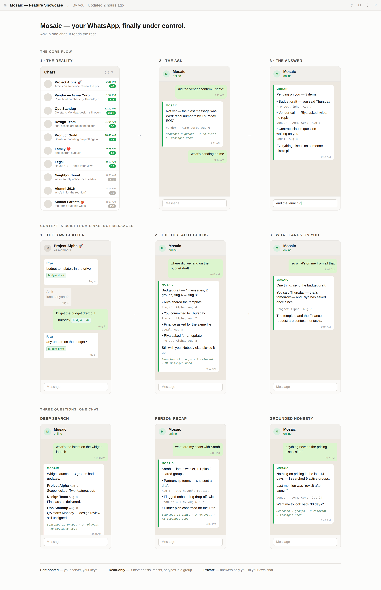

# Mosaic — Your WhatsApp, finally under control.

**Mosaic** is an AI assistant that lives in your WhatsApp. It reads your group chats, tracks what's pending on you, and answers questions like "what's the latest on the widget launch?" — instantly, without opening Slack, email, or any other app.

---

## Why Mosaic

You run your life and work on WhatsApp. 50 groups, hundreds of messages a day. Decisions get buried. Action items slip through. You spend 20 minutes scrolling just to find what someone said about the vendor meeting.

Mosaic fixes this. It scans every message, understands context, and tells you exactly what you need to know — right where you already are.

---

## What It Can Do

- **"What's pending on me?"** — Mosaic finds every commitment, promise, and open question across your chats. Only things *you* need to act on. No noise.
- **"What's happening with the widget launch?"** — Searches all your groups, tells you the latest, who said what, and what needs attention.
- **"Catch me up"** — 24-hour sitrep across all chats. Decisions made, blockers flagged, action items surfaced.
- **"What are my chats with Miten?"** — Summarizes your 1-on-1 conversations. Never forget what you discussed.
- **Daily summaries** — Schedule automatic digests on any topic. "Send me vendor updates every morning at 9."

---

## How It Works

1. **Deploy in one click** — Railway handles everything.
2. **Pair your WhatsApp** — Scan a QR code, done in 30 seconds.
3. **Send a message** — Talk to Mosaic in a dedicated chat. Ask anything.
4. **Mosaic reads your groups** — It scans messages you've received, finds what matters, and replies privately. Nobody knows you're using it.

Mosaic **never** posts in your group chats. It's your personal reader, not a group bot.

---

## Deploy

**1-click deploy, free tier works.** After deploy:
1. Open the console link Railway gives you
2. Create a password
3. Paste your Gemini API key ([get one free](https://aistudio.google.com))
4. Scan the WhatsApp QR code
5. Send the pairing code in your chosen chat

That's it. Mosaic sends a welcome message. You're live.

---

## What Users Say

> "Replaced my morning status-check habit. I ask Mosaic 'what's open' and get a clean list — no scrolling through 20 groups."
>
> "I use it to prep for meetings. 'What did Rachit say last week about the partnership?' — answer in 10 seconds."

---

## Privacy

Your messages stay on your server. Mosaic runs on your own Railway instance. Your Gemini API key is stored with restricted permissions. No third-party access, no cloud sharing.

Read the full build log → [`HERMES.md`](HERMES.md)

---

*Built for people who live on WhatsApp. One chat. Every answer.*
